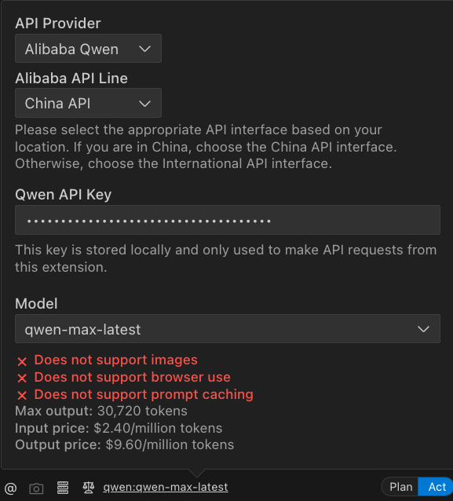
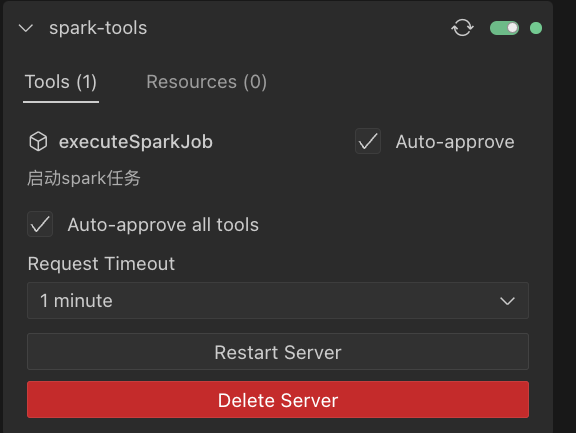
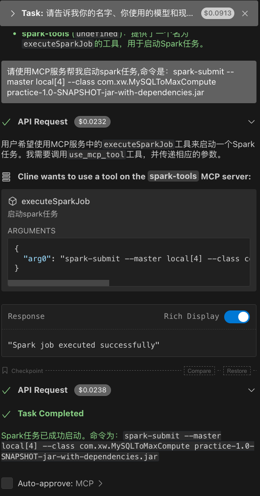

# MCP Server Demo工程

## 1. 流程和实现效果
该工程用于完成大模型调用MCP Server（Tool）执行一个Spark任务的流程。

阿里云百炼平台上可以选择模型结合自建MCP完成该流程，但存在限制MCP Server需要使用函数计算FC或者自建公网服务。由于缺乏服务器资源，使用替代服务完成当前流程：

- 申请百炼云试用token，在本地远程调用模型；
- 使用vs-code + cline插件作为MCP host，提供入口；
- 配置cline，使用百炼提供的千问模型，同时配置本地启动MCP服务器提供给模型调用；
- 开发MCP Server Demo，使用spring-ai完成快速开发，tool方法提供调用上一个task的入口；

完成的效果是：
1. 在cline向模型提问：请使用MCP Server帮我启动一个Spark任务；
2. 模型请求调用MCP Server，选择允许或者提前配置 auto approve；
3. MCP Server接收请求，运行Spark任务，在任务执行之后返回执行信息给模型；
4. 模型将会把当前信息返回给提问者；

相关图片：
1. cline配置-使用千问模型

2. cline配置-配置MCP Server

3. 对话信息

## 2. 工程介绍
由于使用了spring-ai提供的能力，所以在MCP开发上是非常简洁的，只需要完成tool注册即可。

如果不使用spring-ai，也可以使用mcp SDK自行对应功能。

可以使用run-sse-server.sh脚本启动mcp server。

工程中提供了sse方式的client端实现，可以测试sse的调用。
